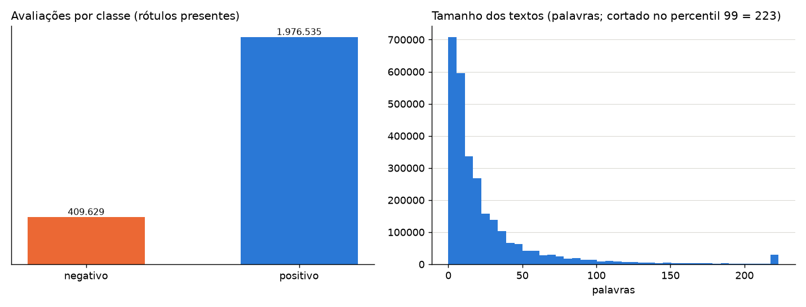
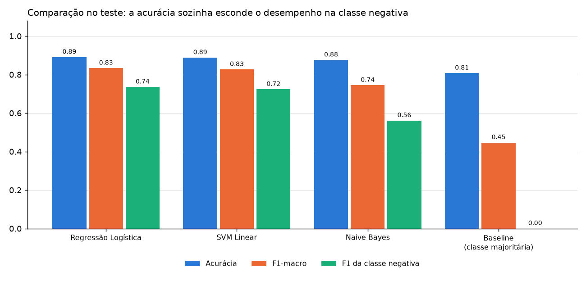
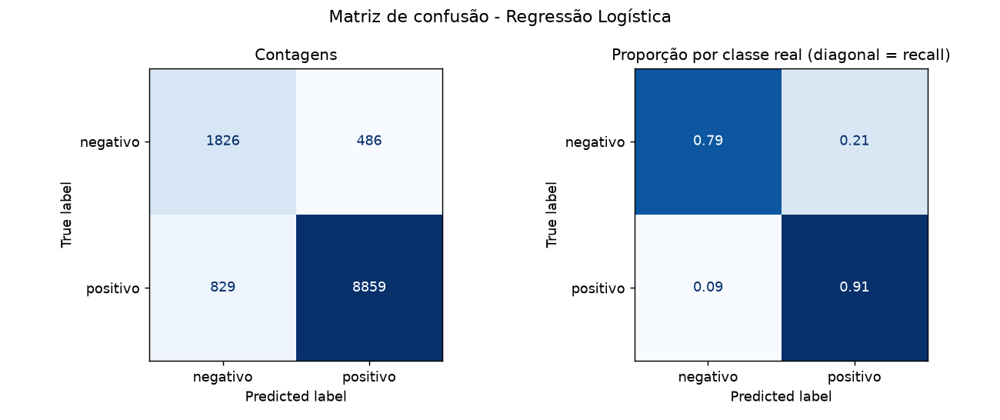
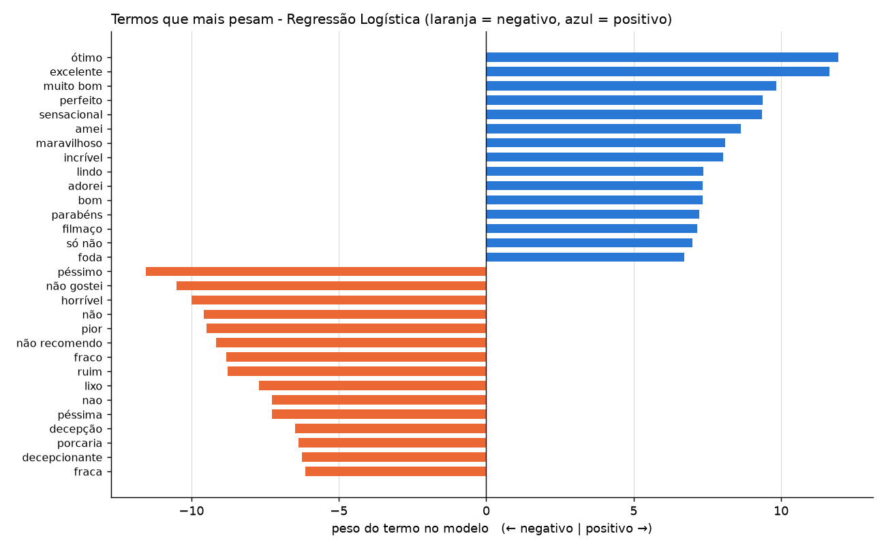

# Relatório automático - Análise de sentimentos PT-BR

Gerado por `app.py` em 2026-10-08 16:04 (Python 3.14.7, scikit-learn 1.9.1, pandas 3.0.6, numpy 2.5.3).

Todos os números abaixo vêm da execução deste script; nada foi digitado à mão.

## Configuração

- Fonte única: `archive/concatenated.csv` (colunas `review_text` e `polarity`)
- Amostra: 60000 linhas estratificadas | semente 42 | teste 20.0% | CV 3 folds
- Remover conflitos: True | dedup após normalizar: True

## Etapa 3 - EDA (dados brutos)

- Registros: 2.786.092 | ausentes: texto 1. rótulo 399.928 | textos duplicados: 344.918
- Classes entre rótulos presentes: positivo 82.8%, negativo 17.2%
- Tamanho (palavras): média 26.7, mediana 13, máximo 10605
- Interpretação: as classes são desbalanceadas, então a acurácia sozinha engana; a cauda longa de tamanhos indica poucos textos muito grandes.



## Etapa 4 - Tratamento

| Passo | Registros depois |
|---|---:|
| Brutos | 2.786.092 |
| Sem ausentes (texto e rótulo) | 2.386.163 |
| Sem textos duplicados exatos | 2.066.231 |
| Após limpeza (remove textos com até 2 letras) | 2.062.861 |
| Sem conflitos/duplicados após normalizar | 1.963.776 |
| Amostra usada no experimento | 60.000 |

- Textos iguais com rótulos conflitantes (após normalizar): 2332
- Ausentes: removidos (sem texto ou rótulo não há o que aprender; não se inventa sentimento).
- Duplicados/conflitos: removidos para o mesmo texto não cair no treino e no teste (vazamento).
- Limpeza: minúsculas, remoção de links e símbolos, acentos mantidos.
- Outliers: textos longos NÃO foram removidos; o gráfico foi só cortado no percentil 99.
- Codificação: rótulo já é 0/1; texto vira números com TF-IDF (1 e 2 palavras) dentro do Pipeline.
- Escalonamento: não aplicado; o TF-IDF já normaliza cada vetor.
- `kfold_polarity`: valores (até 12 primeiros):
kfold_polarity
-1     399928
 1     238618
 2     238618
 3     238617
 4     238617
 5     238617
 6     238617
 7     238617
 8     238616
 9     238614
 10    238613
Não usada: o significado não foi confirmado; usamos divisão própria.

## Etapa 5 - Baseline

`DummyClassifier(strategy='most_frequent')`: sempre prevê a classe mais comum. No teste: acurácia 0.8073 e F1-macro 0.4467.

## Etapas 6 e 7 - Modelos e validação

Todos usam TF-IDF + classificador no mesmo Pipeline. A escolha do melhor modelo usou a validação cruzada no treino; o teste só entrou na avaliação final.

GridSearchCV na Regressão Logística (C em [0.1, 1, 5, 10]): melhor C = 5, F1-macro de validação = 0.8305.

Naive Bayes e SVM Linear usaram os parâmetros padrão do script (sem busca), o que favorece levemente a Regressão Logística na comparação.

**Modelo escolhido: Regressão Logística.**

## Etapa 8 - Métricas (teste)

```
                       modelo  acuracia  acuracia_balanceada  precisao_neg  recall_neg  f1_neg  precisao_pos  recall_pos  f1_pos  f1_macro  f1_macro_cv_media  f1_macro_cv_desvio
          Regressão Logística    0.8904               0.8521        0.6878      0.7898  0.7353        0.9480      0.9144  0.9309    0.8331             0.8305              0.0034
                   SVM Linear    0.8878               0.8396        0.6888      0.7612  0.7232        0.9416      0.9179  0.9296    0.8264             0.8278              0.0033
                  Naive Bayes    0.8758               0.6990        0.8806      0.4113  0.5607        0.8754      0.9867  0.9277    0.7442             0.6892              0.0063
Baseline (classe majoritária)    0.8073               0.5000        0.0000      0.0000  0.0000        0.8073      1.0000  0.8934    0.4467             0.4467              0.0000
```

**Por que estas métricas:** com poucas avaliações negativas, um modelo que só diz "positivo" já teria acurácia alta (veja o baseline). Por isso o foco é o **F1-macro** (média igual das duas classes) e o **recall da classe negativa**, que mostra quantas reclamações reais o modelo encontra. A precisão mostra quantos alertas de negativo são verdadeiros. A matriz de confusão detalha os tipos de erro.





## Etapa 9 - Explicabilidade

Modelo explicado: Regressão Logística. Pesos positivos puxam para *positivo*; negativos, para *negativo*.

- Termos mais negativos: péssimo, não gostei, horrível, não, pior, não recomendo, fraco, ruim, lixo, nao, péssima, decepção
- Termos mais positivos: ótimo, excelente, muito bom, perfeito, sensacional, amei, maravilhoso, incrível, lindo, adorei, bom, parabéns



Limitações: os pesos mostram associações aprendidas nesta base, não causas; palavras como "não" mudam de sentido conforme o contexto, e o modelo não entende ironia nem comparações de preço sutis.

### Frases de teste

- **OK** previsto *positivo* (esperado positivo): "Produto excelente, chegou antes do prazo e superou minhas expectativas" - termos: excelente (+1.96), antes do (+0.89), do prazo (+0.78), superou (+0.69), minhas expectativas (+0.59)
- **OK** previsto *negativo* (esperado negativo): "Péssimo, chegou quebrado e ninguém resolveu meu problema" - termos: péssimo (-3.37), quebrado (-0.66), problema (-0.31), resolveu (+0.26), meu problema (-0.21)
- **OK** previsto *negativo* (esperado negativo): "Muito caro para o que entrega, não vale o preço que paguei" - termos: não vale (-1.69), paguei (-0.84), não (-0.81), caro (-0.58), preço que (-0.37)
- **OK** previsto *positivo* (esperado positivo): "Ótima qualidade e preço justo, recomendo" - termos: recomendo (+1.36), ótima (+1.11), ótima qualidade (+0.83), qualidade (+0.48), preço (+0.32)

## Arquivos gerados

`eda_graficos.png`, `comparacao_modelos.png`, `matriz_confusao.png`, `termos_mais_importantes.png`, `comparacao_modelos.csv`, `grade_hiperparametros.csv`, `coeficientes_termos.csv`, `exemplos_de_erros.csv`, `modelo_sentimentos.joblib`.

Aviso: só carregue arquivos `.joblib` gerados por você; arquivos de terceiros podem executar código.